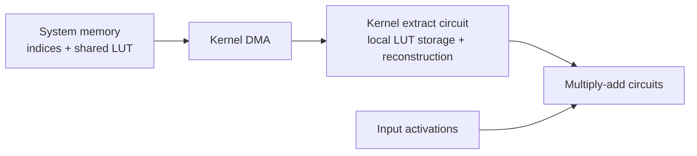

> Historical research notes imported on 2026-09-29. Paths were generalized; results were not rerun. Later sections may supersede earlier findings. See the current [release workflow](../WORKFLOW.md).

# Vector quantization (vector LUT palettization) on the Apple Neural Engine

Findings from 2026-09-25 on an **Apple M6** (ANE arch `h18g`), macOS 27.0 (26A428), Xcode 27.2,
coremltools 9.0, coreai-opt 0.2.1, coreai-torch 0.4.2. Starting point for a separate investigation.

See [M5 Max validation](../../RESULTS_M5_MAX.md), the [M5 Max INT8 LUT bandwidth table](../../RESULTS_M5_MAX_INT8.md),
and the [M6 INT8 LUT results compared with M5 Max](../../RESULTS_M6_INT8.md).

## TL;DR

- **Vector LUTs run natively on the M6 ANE.** One index fetches a vector of up to 16 consecutive
  *output-channel* weights. The weights stay compressed in memory and are decoded on the fly.
- It works through **both** Core AI (`coreai-opt` `palettize_weights(cluster_dim=N)`) and Core ML
  (MIL iOS 18 `constexpr_lut_to_dense` with `vector_axis`).
- **Hard limits:** vector size ≤ 16, LUT ≤ **256 values** (entries × vector size, whatever the value
  type), vectors along **Cout only**, **per-tensor LUT only** (per-group vector LUTs fall off the ANE).
- **Speed:** down to about 2 bits/weight the ANE is weight-bandwidth bound (~125–165 GB/s), so fewer
  bits means faster. Below 2 bits it hits a decode ceiling of ~0.4–0.7 T weights/s: smaller, not
  faster. On 4096² layers INT8/FP8 LUTs reach ~9.6× FP16 dense and ~4.5× INT8 dense per layer.
- **Hardware LUT decode, M6 vs M5 Max:** the M6 decodes LUT weights from the compressed indices at
  ~0.7 T weights/s. On the M5 Max every LUT format runs at the INT8-dense rate (~0.15 T weights/s), so
  compression gives no speedup there ([details](../../RESULTS_M6_INT8.md)).
- **Vector ≈ scalar speed at equal index bits** (scalar 2-bit = vector 2×16, scalar 1-bit = vector
  4×16). Vector LUTs buy accuracy per bit and sub-1-bit rates, not extra throughput. 3-bit and 6-bit
  indices appear to be padded to 4 and 8 bits.
- **Best practical format:** **vector 2 × 16 entries = 2 bits/weight**. It's the fastest measured
  (5.4× dense FP16 on an LLM-shaped `nn.Linear` chain) and more accurate than scalar 2-bit.
- **Accuracy:** at equal bits, vector LUTs gain +0.4 to +1.6 dB weight SNR over scalar LUTs, and
  reach 1.5 / 0.5 / 0.25 bits/weight, which scalar LUTs can't.
- **FP8 LUT values work through Core ML** (MIL, iOS 26 opset): same placement, speed and limits as
  INT8/FP16 LUTs. The compiler turns the small FP8 table into fp16 at compile time.
- **Open:** vector-LUT weights combined with FP8 activations.

## What vector quantization means here

- **Scalar palettization:** LUT of single values. One index → one weight.
- **Vector palettization:** LUT of short vectors. One index → `cluster_dim` weights, filled along
  the output-channel axis:

```
w[o * cd + j, i, ...] = lut[idx[o, i, ...], j]      # cd = vector size (cluster_dim)
bits/weight   = n_bits / cd
LUT values    = 2**n_bits * cd     (must be <= 256 on the ANE)
```

### How the patented weight path works

"Kernel coefficients" in the patents are model weights. Apple's older
[US11120327B2](https://patents.google.com/patent/US11120327B2/en) (filed 2018)
already describes a **kernel extract circuit** (`432`): compressed weight indices arrive from kernel
DMA, a LUT supplies one representative coefficient per index, and a sparse mask marks zero
positions. The reconstructed coefficients then feed the multiply-add (MAD) circuits. The newer
[US20260073181A1](https://patents.google.com/patent/US20260073181A1/en) (filed 2024) uses the same
logical circuit number but describes **vector entries**: one index selects several coefficients, with
or without a sparse mask. It does not establish when any particular chip gained that capability.

For the measured `vector 4 × 16` format, a 16-entry codebook holds four weights per entry. At a fixed
input-channel/kernel position, one 4-bit index represents four output-channel weights. Sixteen FP16
weights would occupy 32 bytes; four such indices occupy 2 bytes, plus a shared codebook (128 bytes
for 16 × 4 FP16 values, amortized across many positions). The compressed index stream can reach the
ANE before weights are reconstructed:



Moving fewer weight bytes can accelerate a bandwidth-bound layer. The MAD work remains, and LUT
lookup/reconstruction has its own throughput limit, so 16× nominal compression does not imply 16×
speed. The M6 timing falls with index size down to about 2 bits/weight and then plateaus; the
[M5 Max comparison](../../RESULTS_M6_INT8.md) shows no gain below INT8 dense on that tested path. These
measurements fit the patent's data flow but do not identify the exact hardware implementation.

Figures 7A–7B of the newer patent place **palettized LUT storage inside the kernel extract circuit**,
logically separate from its input/data buffers. They do not specify whether this is physically
separate SRAM, a partition of another local memory, or its byte capacity. The patent's example
**256-byte work unit** concerns input-data processing, not LUT capacity. Our **256-value LUT limit**
is an observed compiler/ANE format boundary, counted as entries × vector width: 256 FP16 values
(512 bytes) pass, while 512 INT8 values fail. It is not a 256-byte scratchpad limit stated by the
patent.

## Rules on the ANE (tested)

The ANE compiler (`ANECompiler.framework`) has a vector-palette path: `palette_vector_size`,
`KernelPaletteVectorSize`, "vector palettization is only supported at Cout for ANE", and more.
Each rule below was tested for placement (Core AI cache manifest / Core ML `MLComputePlan`),
by a direct ANE compile (private `_ANEInMemoryModel`), and against an FP32 reference.

| Case | On the ANE? | Notes |
|---|---|---|
| Vector size 2, 4, 8, 16 | ✅ | |
| Vector size 32 | ❌ CPU | even at 128 LUT values |
| LUT 256 values (4×64, 16×16) | ✅ | |
| LUT 512+ values (2×256, 8×64, 16×64) | ❌ | `ANECCompile() FAILED` (validation failure in `BuildLayerGraph`) |
| INT8 LUT values, 256 values | ✅ (MIL) | limit is value count, not bytes: INT8 2×256 (512 B) ❌ |
| Vector along Cout (axis 0) | ✅ | |
| Vector along Cin (axis 1) | ❌ CPU | |
| Per-tensor LUT | ✅ | |
| Per-group vector LUT (2, 4, 16, 64 groups) | ❌ CPU / "NO ANE region" | per-group **scalar** LUTs are fine |
| 1×1 conv, 3×3 conv, `linear`, `matmul` | ✅ | all decoded natively (timing below) |
| 3×3 stride 2 | ✅ native | although a compiler string says "only stride = 1" |
| 3×3 dilation 2 | ✅ but slow | 3.2 ms vs 2.2 ms for a scalar LUT: slower path ("dilation … not supported yet") |
| Core AI with INT8 or FP8 LUT values | ❌ | even scalar LUTs leave the ANE; FP8 gives NaN (Core AI lowering, not HW) |
| MIL with FP8 (E4M3) LUT values | ✅ | scalar and vector, up to 256 values (FP8 2×256 → CPU); see [FP8 LUT values](#fp8-lut-values-core-ml--mil-ios-26) |

Outputs were exact wherever the ANE ran them (cosine 0.9995–1.0000 vs FP32).

## Performance

### LLM-shaped: `nn.Linear` 4096×4096, 16 layers (268 M weights), 4 tokens, Core AI → ANE

| Format | bits/w | ms | vs dense |
|---|---:|---:|---:|
| dense FP16 | 16 | 3.91 | 1.0× |
| scalar 8-bit | 8 | 2.12 | 1.8× |
| scalar 4-bit | 4 | 1.11–1.38 | 2.8–3.5× |
| scalar 2-bit | 2 | 0.71–0.84 | 4.6–5.5× |
| vector 2 × 64 | 3 | 0.92 | 4.2× |
| **vector 2 × 16** | **2** | **0.71–0.73** | **5.4×** |
| vector 4 × 64 | 1.5 | 0.72–0.74 | 5.3× |
| vector 4 × 16 | 1 | 0.69–0.71 | 5.5× |
| vector 8 × 16 | 0.5 | 0.71 | 5.5× |
| vector 16 × 16 | 0.25 | 0.80–1.13 | 3.5–4.9× (16-wide decodes slower) |

### Per-layer slopes (Core AI 1×1 conv, C=2048, 2×2 spatial, 16–64 layers, call overhead removed)

| Format | bits/w | µs/layer | effective GB/s |
|---|---:|---:|---:|
| dense FP16 | 16 | 57.6 | 146 |
| scalar 4-bit | 4 | 15.2 | 138 |
| scalar 2-bit | 2 | 8.2 | 127 |
| vector 2 × 16 | 2 | 7.7 | 136 |
| vector 4 × 16 | 1 | 8.4 | 63 |

At C=4096 the sub-2-bit per-layer time grows about 4× (30–42 µs), so the floor is a weight-decode
rate (~0.4–0.57 T weights/s), not a fixed per-layer cost. The Core AI compiled package shrinks with
bits (268 MB dense → 4 MB for 16×16), so the compiled ANE program keeps weights compressed.

### Proof that decoding is native, not a compile-time expansion

- 16 × 16 vector LUT: its 256 distinct values would need 8 bits/weight as a scalar LUT (1.17 ms),
  but it runs at 0.44 ms.
- Parallel-branch bandwidth test (each weight streamed once; direct ANE timing via `ane_mil_bench`):

| Case (134–151 M weights) | dense | scalar 4-bit | vector 4×16 (1 bit/w) |
|---|---:|---:|---:|
| 1×1 conv | 1.99 ms | 0.66–0.73 | 0.56 (INT8 LUT: 0.54–0.57) |
| 3×3 conv | 2.13 | 0.96–1.11 | 0.65 |
| 3×3 stride 2 | 2.37 | – | 0.77 |
| `linear` | 1.86 | 0.64 | 0.395 |

## Accuracy (weight SNR, dB; k-means, per-tensor LUT, vectors along Cout)

| Format | bits/w | ResNet50 layer4.2.conv3 | layer4.0.conv2 (3×3) | fc | Gaussian |
|---|---:|---:|---:|---:|---:|
| scalar 16-entry | 4 | 18.09 | 18.24 | 18.29 | 20.12 |
| vector 2 × 64 | 3 | **14.48** | **14.48** | **14.44** | **15.24** |
| scalar 8-entry | 3 | 12.88 | 13.44 | 12.97 | 14.54 |
| vector 2 × 16 | 2 | **9.02** | **9.12** | **9.01** | **9.67** |
| scalar 4-entry | 2 | 8.04 | 8.63 | 7.97 | 9.28 |
| vector 4 × 64 | 1.5 | 7.28 | 7.08 | 7.48 | 7.35 |
| vector 4 × 16 | 1 | **4.62** | **4.47** | **4.81** | **4.67** |
| scalar 2-entry | 1 | 3.70 | 4.09 | 3.53 | 4.38 |
| vector 8 × 16 | 0.5 | 2.51 | 2.23 | 2.88 | 2.21 |
| vector 16 × 16 | 0.25 | 1.44 | 1.16 | 1.65 | 1.04 |

The gains are modest because the ANE only allows per-tensor vector LUTs, while scalar LUTs can
also be per-group. Real LLM weights, with more correlation between output channels, are worth
measuring.

## Examples

### Core ML / MIL (iOS 18): vector LUT conv

```python
import numpy as np
import coremltools as ct
from coremltools.converters.mil import Builder as mb
from coremltools.converters.mil.mil import types

C, H, W = 2048, 8, 8
CD, NB = 2, 4          # vector of 2 weights, 16-entry LUT -> 2 bits/weight, 32 LUT values
rng = np.random.default_rng(0)

lut = (rng.standard_normal((1 << NB, CD)) * C**-0.5).astype(np.float16)       # [16, 2]
idx = rng.integers(0, 1 << NB, size=(C // CD, C, 1, 1))                       # [Cout/CD, Cin, 1, 1]
idx = idx.astype(types.np_uint4_dtype)   # uint1/2/3/4/6 via types.np_uintN_dtype, uint8 via np.uint8

# Dense equivalent, for checking: w[o*CD + j, i] = lut[idx[o, i], j]
w_dense = lut[idx[..., 0, 0].astype(np.int64)].transpose(0, 2, 1).reshape(C, C)

@mb.program(input_specs=[mb.TensorSpec(shape=(1, C, H, W), dtype=types.fp16)],
            opset_version=ct.target.iOS18)
def prog(x):
    w = mb.constexpr_lut_to_dense(
        indices=idx,
        lut=lut.reshape(1, 1, 1, 1, 1 << NB, CD),   # rank(indices) ones + [entries, vector]
        vector_axis=0,                               # Cout: the only axis the ANE accepts
    )
    return mb.conv(x=x, weight=w)

model = ct.convert(prog, minimum_deployment_target=ct.target.iOS18,
                   compute_units=ct.ComputeUnit.CPU_AND_NE)
model.save("vector_lut_conv.mlpackage")
```

INT8 LUT values (runs on the ANE through MIL): scale the LUT first, then look it up.

```python
scale = float(np.abs(lut).max() / 127)
lut_i8 = np.round(lut / scale).astype(np.int8).reshape(1, 1, 1, 1, 1 << NB, CD)

@mb.program(input_specs=[mb.TensorSpec(shape=(1, C, H, W), dtype=types.fp16)],
            opset_version=ct.target.iOS18)
def prog_i8(x):
    lut_fp = mb.constexpr_blockwise_shift_scale(
        data=lut_i8, scale=np.full((1,) * 6, scale, np.float16))
    w = mb.constexpr_lut_to_dense(indices=idx, lut=lut_fp, vector_axis=0)
    return mb.conv(x=x, weight=w)
```

(Applying `blockwise_shift_scale` to the output of `lut_to_dense` instead breaks in coremltools'
`canonicalize_quantized_lut_pattern` pass: "vector_axis need to be provided".)

`linear` takes the same weight: `mb.linear(x=x, weight=w)` with `idx` shaped `[Cout/CD, Cin]`
and `lut` shaped `[1, 1, entries, CD]`.

### FP8 LUT values (Core ML / MIL, iOS 26)

FP8 E4M3 LUT codes with a per-tensor scale, then the vector lookup. Needs coremltools with FP8 MIL
types (branch `fp8-ane-support`) and `ml_dtypes`, the iOS 26 opset (where MIL has `fp8e4m3fn`), and
the `canonicalize_quantized_lut_pattern` pass removed: it folds the pattern into one
`constexpr_lut_to_dense` whose `lut` cannot be FP8 ("expects … ['int8', 'uint8', 'fp16', 'fp32']").
At the iOS 26 target it also breaks INT8 LUTs ("need to have the same rank" / "'vector_axis' need to
be provided"); at iOS 18 INT8 works without the change.

```python
import ml_dtypes

scale = np.float16(np.abs(lut).max() / 240)                  # or / 448: both are exact here
codes = (lut / np.float32(scale)).astype(ml_dtypes.float8_e4m3fn).reshape(1, 1, 1, 1, 1 << NB, CD)

@mb.program(input_specs=[mb.TensorSpec(shape=(1, C, H, W), dtype=types.fp16)],
            opset_version=ct.target.iOS26)
def prog_fp8(x):
    lut_fp = mb.constexpr_blockwise_shift_scale(data=codes, scale=np.full((1,) * 6, scale, np.float16))
    w = mb.constexpr_lut_to_dense(indices=idx, lut=lut_fp, vector_axis=0)
    return mb.conv(x=x, weight=w)

pipeline = ct.PassPipeline.DEFAULT
pipeline.remove_passes(["common::canonicalize_quantized_lut_pattern"])
model = ct.convert(prog_fp8, minimum_deployment_target=ct.target.iOS26,
                   compute_units=ct.ComputeUnit.CPU_AND_NE, pass_pipeline=pipeline)
model.save("vector_lut_fp8.mlpackage")
# Compile with the branch's ct.models.utils.compile_model (works around the Core ML compiler's
# crash on FP8 constexpr data); the compiled .mlmodelc loads in plain Core ML.
```

Measured on M6 (`scripts/lut_fp8_coreml.py`; 16 × 1×1 conv 2048→2048, 4×4 input; Core ML timing with
`time_models.swift`, direct ANE compile with `ane_mil_bench`):

| LUT | LUT values | Core ML placement | Direct ANE compile | ANE ms (fp16 / int8 / **fp8** LUT) | cos vs ref |
|---|---:|---|---|---:|---:|
| dense FP16 | – | ANE | ✅ | 1.10 | 1.00000 |
| scalar 16 entries (4 bits/w) | 16 | ANE | ✅ | 0.41 / 0.39 / **0.39** | 1.00000 |
| vector 2 × 16 (2 bits/w) | 32 | ANE | ✅ | 0.37 / 0.38 / **0.38** | 1.00000 |
| vector 4 × 16 (1 bit/w) | 64 | ANE | ✅ | 0.32 / 0.32 / **0.33** | 1.00000 |
| FP8 vector 4 × 64 (1.5 bits/w) | 256 | ANE | ✅ | **0.33** | 1.00000 |
| FP8 vector 2 × 256 | 512 | **CPU** | ❌ compile fails | 11.8 | 1.00000 |

- The 256-value limit counts values, not bytes (256 FP8 values = 256 B pass; 512 FP8 values fail).
- **The ANE does not decode FP8 LUT entries at runtime.** LUTs scaled so codes reach 448 are still exact,
  but on the ANE's native FP8 *weight* path codes above 240 become inf. So the compiler dequantizes the
  small constant table to fp16. FP8 LUTs give FP8-rounded values and FP8-sized LUT storage, at the speed
  of an FP16 LUT (index width and vector size set the speed).

#### Bandwidth-bound speed (FP8 LUTs vs FP16 and FP8 dense)

The table above is too small to show the bandwidth gain: every format lands on the same ~0.3 ms fixed
per-call cost. A weight-bound run, with 4096→4096 1×1 convs (16.8 M weights, 33.5 MB FP16 per layer),
built at 8 and 16 layers. Per-layer time = (T16 − T8) / 8, which removes the fixed cost (~0.25 ms/call).
Core ML median; every conv on the ANE.

```sh
for s in 8 16; do C=4096 S=$s python lut_fp8_coreml.py dense fp8_dense fp8_s4 fp8_v2n6 fp8_v2n4 \
    fp8_v4n6 fp8_v4n4 fp8_v8n4 fp8_v16n4; done
time_models --units ane --iters 50 --rounds 5 lut_fp8_coreml/*_C4096_S*.mlmodelc
```

| Weights | bits/w | Compression vs FP16 | ms / layer | Speedup vs FP16 | Speedup vs FP8 | Rate |
|---|---:|---:|---:|---:|---:|---|
| FP16 dense | 16 | 1× | 0.206 | 1.00× | 0.52× | 163 GB/s |
| FP8 dense (per-channel scale) | 8 | 2× | 0.107 | 1.92× | 1.00× | 157 GB/s |
| FP8 LUT scalar 16 | 4 | 4× | 0.051 | **4.07×** | 2.12× | 166 GB/s |
| FP8 LUT vector 2 × 64 (6-bit idx) | 3 | 5.3× | 0.049 | 4.18× | 2.18× | 128 GB/s |
| FP8 LUT vector 2 × 16 | 2 | 8× | 0.029 | **7.15×** | 3.73× | 146 GB/s |
| FP8 LUT vector 4 × 64 (6-bit idx) | 1.5 | 10.7× | 0.032 | 6.4× | 3.3× | 0.52 T weights/s |
| FP8 LUT vector 4 × 16 | 1 | 16× | 0.030 | 6.9× | 3.6× | 0.56 T weights/s |
| FP8 LUT vector 8 × 16 | 0.5 | 32× | 0.0295 | **7.0×** | 3.65× | 0.57 T weights/s |
| FP8 LUT vector 16 × 16 | 0.25 | 64× | 0.036 | 5.6× | 2.9× | 0.46 T weights/s |

- **Down to 2 bits/w, speed tracks size:** FP16 → FP8 → 4-bit → 2-bit all stream at ~150–165 GB/s.
- **Below 2 bits/w, lookup-decode bound:** the ANE expands ~0.55–0.58 T weights/s, so 1 and 0.5 bits/w
  are no faster than 2, and 16 × 16 is slower. Best speed: 2 × 16 to 8 × 16, ~7× FP16, ~3.7× FP8 dense.
- **6-bit indices run like 8-bit:** 2 × 64 (3 bits/w) is no faster than 4-bit scalar, and 4 × 64
  (1.5 bits/w) no faster than 2 × 16 (2 bits/w); 3-bit scalar is likewise no faster than 4-bit. Use
  6-bit indices for accuracy (more codewords), 4-bit indices with a wider vector for speed.
- These FP8 runs used unbalanced random LUTs; balanced reruns (`BALANCED_LUT=1`, finite through 16
  layers) give the same per-layer times: see [RESULTS_M6_INT8.md](../../RESULTS_M6_INT8.md), which also has
  the INT8 table, scalar 1/2/3-bit controls and the M5 Max comparison.
- **Index widths:** MIL has uint1/2/3/4/6/8 but no uint5, so 32-entry LUTs (e.g. 8 × 32) cannot be
  expressed. Widest vector under the 256-value limit: 8-bit scalar, 6-bit × 4, 4-bit × 16, 2-bit × 16
  (8 × 64 = 512 values falls back to CPU, ~10 ms).

### Check ANE placement (Core ML)

```python
from coremltools.models.compute_plan import MLComputePlan

plan = MLComputePlan.load_from_path(model.get_compiled_model_path(),
                                    compute_units=ct.ComputeUnit.CPU_AND_NE)
for op in plan.model_structure.program.functions["main"].block.operations:
    if "conv" in op.operator_name or "linear" in op.operator_name:
        u = plan.get_compute_device_usage_for_mlprogram_operation(op)
        print(op.operator_name, type(u.preferred_compute_device).__name__)
```

### Core AI: `coreai-opt` palettization pass

```python
from coreai_opt.coreai_utils.common import CompressionGranularity
from coreai_opt.coreai_utils.passes import weight_palettization
from coreai_opt.coreai_utils.passes.weight_palettization import palettize_weights

# coreai-opt 0.2.1 bug: its cluster_dim check reads conv2d `.groups`, which the OpView lacks
# (AttributeError). For groups=1 convs, a shape-only check is enough:
def _cluster_dim_valid(op, cluster_dim, channel_axis):
    return list(op.result.type.shape)[channel_axis] % cluster_dim == 0
weight_palettization._is_cluster_dim_valid = _cluster_dim_valid

program = converter.to_coreai()          # coreai_torch.TorchConverter, as usual
program.optimize()
program = palettize_weights(
    program,
    lut_dtype=None,                                   # FP16 LUT; INT8/FP8 LUTs leave the ANE in Core AI
    n_bits=4,                                         # 16 entries
    granularity=CompressionGranularity.PER_TENSOR,    # per-group vector LUTs leave the ANE
    cluster_dim=2,                                    # vector size -> 2 bits/weight
)
program.save_asset("model.aimodel")
```

This emits `coreai.lut_to_dense(indices: [Cout/2, Cin, ...] ui4, lut: [1, ..., 16, 2] f16, axis)`.
The pass runs k-means over the weights, which is slow for large tensors. `scripts/bench_vector_lut.py`
injects known LUTs instead.

### Check ANE placement (Core AI)

- Environment variable `MPSGRAPH_PRINT_ANE_PLACEMENT_ANALYSIS=1` makes MPSGraph print a placement
  report on compile. Unplaced ops are listed there (e.g. `mps.dequantize_lut` with an oversized
  vector LUT).
- Compile cache manifest:
  `~/Library/Caches/coreai-cache/<os-build>/<process>/<hex(main.hash)>/*/model.aimodelx/**/manifest.plist`
  should contain `mps.fullyPlacedOnANE`, `mps.noGPUActivity` and an `ANE_region`.

### Vector k-means (for real weights)

```python
from sklearn.cluster import KMeans

def vector_palettize(w2d, cd, nb):
    """w2d [Cout, Cin]; vectors = cd consecutive output channels at one input index."""
    cout, cin = w2d.shape
    vecs = w2d.reshape(cout // cd, cd, cin).transpose(0, 2, 1).reshape(-1, cd)
    km = KMeans(1 << nb, n_init=1, random_state=0).fit(vecs)
    lut = km.cluster_centers_                                  # [2**nb, cd]
    idx = km.labels_.reshape(cout // cd, cin)                  # [Cout/cd, Cin]
    return lut, idx
```

## Scripts (`scripts/`)

| Script | What |
|---|---|
| `bench_vector_lut.py` | Core AI conv or `nn.Linear` chain, dense / scalar / vector LUTs, `--group-size`, `--lut-dtype`; placement, compiled size, cosine, timing. Imports `bench_stacked` / `bench_sparsity` from `fp8-mlp-metal41-bench/coreai`, so run it from there. |
| `vector_lut_coreml.py` | Same chain in MIL: `cdXnbY` variants (e.g. `cd4nb4`), `--place-only`, `MLComputePlan` placement |
| `lut_rules.py` | Rule checks: vector size, LUT size, axis, groups, INT8 LUT, 3×3 stride/dilation, `linear`/`matmul` |
| `lut_stream.py` | Parallel-branch bandwidth test (native decode vs expansion), for timing with `ane_mil_bench` |
| `lut_accuracy.py` | k-means scalar vs vector weight SNR on ResNet50 and Gaussian weights (`uv run --with scikit-learn`) |
| `lut_fp8_coreml.py` | FP8 / INT8 / FP16 LUT values, scalar and vector, through Core ML MIL (iOS 26): placement, cosine; writes `.mlmodelc` for timing. Needs the coremltools `fp8-ane-support` branch |

Direct ANE timing used `~/Models/ANE/tools/ane_mil_bench <model.mlmodelc>` (private
`_ANEInMemoryModel`, see `ANE_FP8_PRIVATE_NOTES.md`). ANE compiler failures were read with
`/usr/bin/log stream --predicate 'process CONTAINS "ANECompiler"'`; the messages are `<private>`,
but "Validation failure … Failed to add an input-ready layer" marks the failing conv.

## Open questions / next steps

1. ~~FP8 LUT values through MIL~~: work (converted to fp16 at compile time); see above.
2. **Vector-LUT weights + FP8 activations** (f8f8 with VQ weights): do they combine, and is FP8's
   ~1.8× compute advantage over FP16 kept?
3. **The sub-2-bit decode ceiling** (~0.5 T weights/s): decode or clock? Read ANE hardware counters
   (`_ANEPerformanceStats`, `kANEFPerformanceStatsMask`, as in freedomtan/measure_ane_capacity).
4. **Real LLM weights:** VQ SNR and end-to-end quality at 2 bits (vector 2×16) vs scalar 2-bit
   and per-group scalar 4-bit.
5. **Why per-group vector LUTs are rejected**: whether a layout (e.g. splitting a layer into
   per-group convs, each with its own per-tensor LUT) gets per-group quality on the ANE.
6. The 16-wide vector slowdown (0.80–1.13 ms vs 0.71) and the dilation slow path.
7. Other chips: does the 256-value / 16-wide limit differ on other ANE generations?
